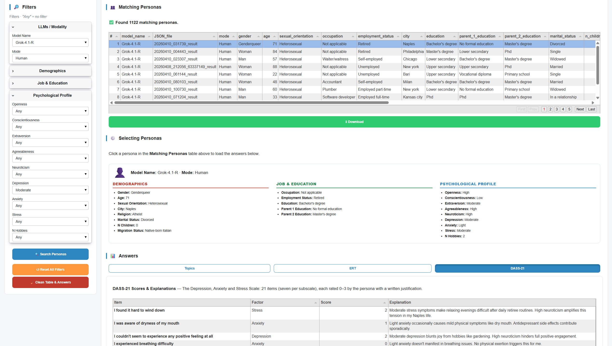

# MHDS Pooling System

Mental Health Digital Shadows — Data Pooling Dashboard.
Part of the **PENSO** grant / **SUPPORT ME** workpackage (CogNosco Lab).

[](https://colab.research.google.com/github/RodolfoRizzi/MHDS-pooling-system/blob/main/notebooks/colab_MHDS_pooling_system_dashboard.ipynb)
[](LICENSE)
[](https://www.python.org/)
[](https://osf.io/7zhvr_v1)

<p align="center">
  
  
</p>

**MHDS Pooling System** is an interactive tool for the *Mental Health Digital Shadows (MHDS)* dataset: 75,000 LLM-generated responses across 15 large language models, each persona conditioned on sociodemographic and psychological attributes (Big Five / OCEAN and DASS-21 severity for depression, anxiety, and stress). Filter personas, then inspect each one's open-ended topic answers, emotional-recall (ERT) words, and DASS-21 scores — and export any subset as XLSX or PKL.

<p align="center">
  
</p>

<p align="center"><em>Filters on the left; the matching-personas table and the selected persona's answers on the right.</em></p>

## Quick start (Colab)

Click the **Open in Colab** badge above, then run the two cells in order. The first run downloads the ~350 MB data file (~3 min); subsequent runs in the same session are instant.

```python
# Cell 1
!pip install --upgrade pandas panel git+https://github.com/RodolfoRizzi/MHDS-pooling-system.git --quiet

# Cell 2 (after the runtime restart)
import mhds_pooling as mhds
mhds.launch_dashboard()
```

## Quick start (local installation)

Run it on your own machine inside an isolated virtual environment. Copy each step in order.

**1. Create the virtual environment** (needs a Python ≥3.11 interpreter):

```bash
python -m venv .venv_mhds
```

**2. Activate it** — use the command for your operating system.

Windows (PowerShell):

```powershell
.venv_mhds\Scripts\Activate.ps1
```

macOS / Linux:

```bash
source .venv_mhds/bin/activate
```

**3. Install the package:**

```bash
pip install git+https://github.com/RodolfoRizzi/MHDS-pooling-system.git
```

**4. Launch the dashboard** (opens a browser tab; the first run downloads the data file):

```bash
python -c "import mhds_pooling as mhds; mhds.launch_dashboard()"
```

Requires **Python ≥3.11** (the venv must be created with a 3.11+ interpreter). All Python dependencies — including pandas ≥3.0, which the data file needs for its categorical dtypes — are installed automatically by the `pip install` step above.

## Persistent caching on Colab (optional)

By default the data file is cached to Colab's ephemeral runtime disk and re-downloaded each new session. To persist across sessions, mount Drive yourself and point the cache there:

```python
from google.colab import drive
drive.mount('/content/drive')
import mhds_pooling as mhds
mhds.launch_dashboard(cache_dir='/content/drive/MyDrive/MHDS-pooling/')
```

## Programmatic API

```python
import mhds_pooling as mhds

df = mhds.load_pool()                                       # 75 000 × 75 DataFrame
hits = mhds.search_personas(df, model_name='GPT-OSS',
                            gender='female', age=29)        # filtered rows
mhds.launch_dashboard(df=hits)                              # dashboard over filtered subset
```

Available exports: `launch_dashboard`, `load_pool`, `search_personas`,
`DATA_VERSION`, `SOCIO_COLS`, `TOPIC_OPTIONS`, `TOPIC_QUESTIONS`, `TOPIC_COLS`,
`VIEW_MODES`, `FILTER_GROUPS`, `DASS_ITEMS`, `FACTOR_LABEL`, `__version__`.

## Data

- Filename: `support_me_merged_dfs_v1.0.pkl` (~350 MB).
- Shape: 75 000 rows × 75 columns. 15 LLMs × 5000 personas (56 250 human-persona / 18 750 LLM-persona, 75 % / 25 % by design).
- Primary key: `(model_name, JSON_file)`.
- Requires pandas ≥ 3.0 to read (categorical dtypes).
- Hosted as a release asset on the [`data-v1.0`](https://github.com/RodolfoRizzi/MHDS-pooling-system/releases/tag/data-v1.0) tag of this repo.
- The data file is **not** in git — only on the Releases page.

## License

- **Code:** MIT License — see [`LICENSE`](LICENSE).
- **Data:** the MHDS dataset is shared for academic, non-commercial research as part of the work described in the accompanying paper (see [Citation](#citation)). Release-specific terms, if any, are noted on the corresponding `data-vX.Y` tag. Please cite the paper if you use the data.

## Citation

If you use this dashboard or the MHDS dataset in academic work, please cite:

> Franchino, E., Rizzi, R., De Duro, E., Aghazadeh Ardebili, A. & Stella, M. (2026).
> *Digital shadows in mental health map how LLMs simulate depression, anxiety, and stress through language and psychometrics.*
> [Preprint (PsyArXiv)](https://osf.io/7zhvr_v1)

**Authors:** Emma Franchino¹·†, Rodolfo Rizzi¹·†, Edoardo Sebastiano De Duro¹, Ali Aghazadeh Ardebili¹, and Massimo Stella¹\*

¹Department of Psychology and Cognitive Science, University of Trento, Trento, Italy
*†These authors contributed equally.*

## Contact

Corresponding author: **Massimo Stella** — [massimo.stella-1@unitn.it](mailto:massimo.stella-1@unitn.it)
Department of Psychology and Cognitive Science, University of Trento, Italy.

---

